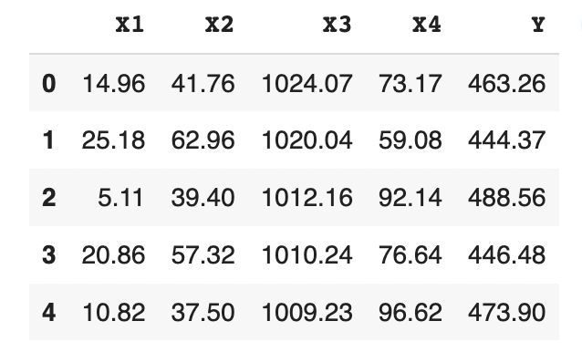
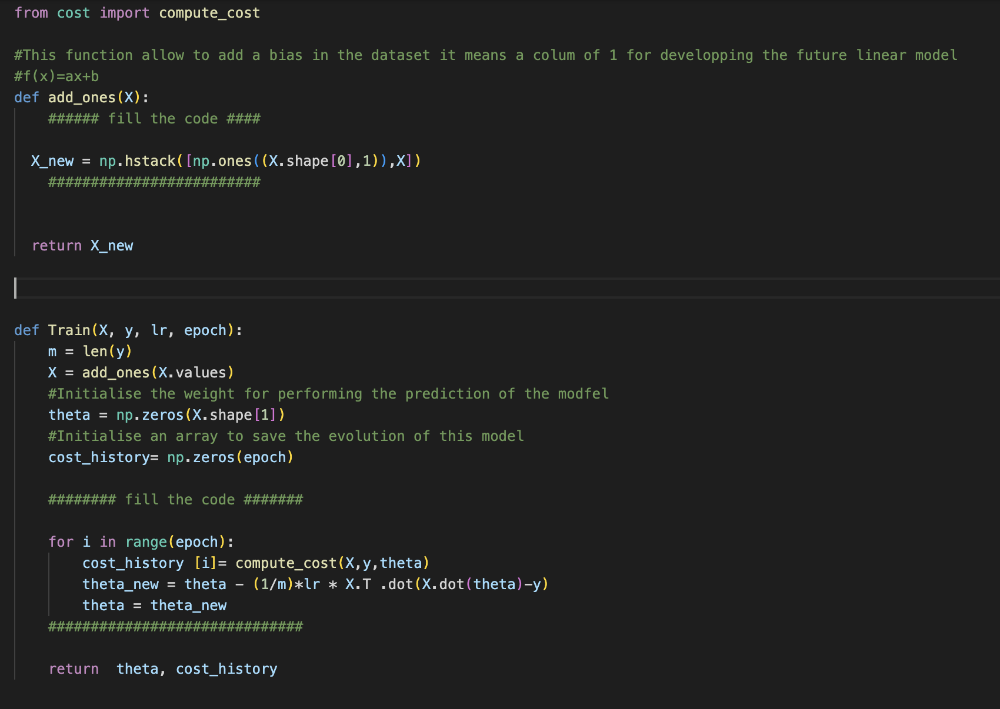
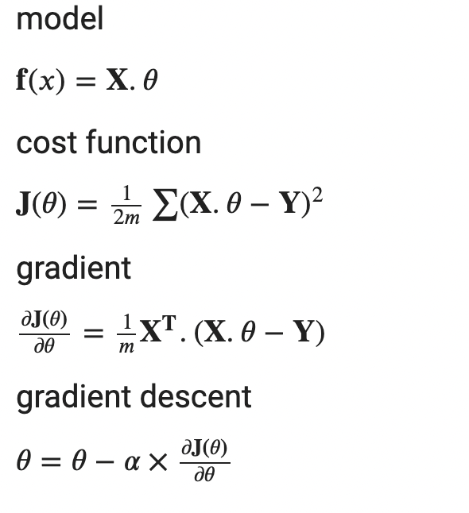
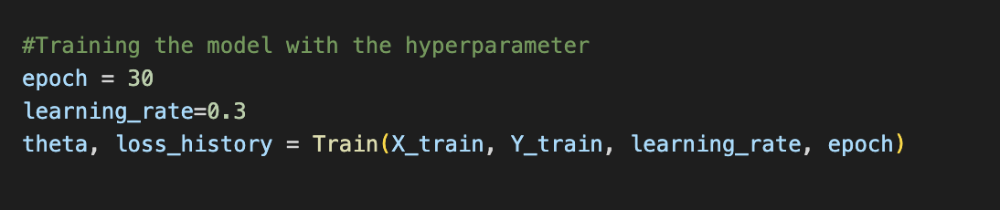
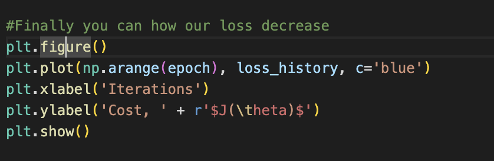
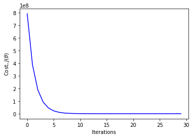
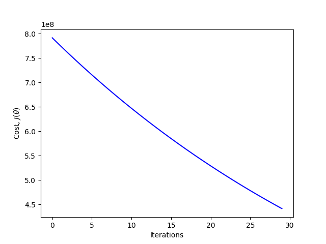

# Problem understanding : Basic Concepts in Machine Learning
In this toy project ,we aim to build a machine learning concept that show how we compute the loss

## create virtual environment ##

```
$ python3 -m venv ENV_NAME
```
## Activate virtual environment ##
```
$ source ENV_NAME/bin/activate
```
## Dataset look like  (x,y)  Linear ##

As we know the dataset look like a matrix , in our case this dataset have 9568 rows and 5 columns , we have in example below:


Once the dataset is generated, we have to add a column of bias to the table X, i.e. a column of 1, for the development of the future linear model f(x) = ax + b, then initialise parameters a,b in a theta vector.

## All function about gradient descent ##

## Training the model ##
To train the model we use some hyperparameter like learning_rate and number of times to train the model it called number of epoch

## Display how the loss decrease during training 


Here we note that our prediction is good if we take a look to how the loss decrease during training it's important to note how the hyperparameter work about compute the loss in the image below learning_rate=0.3 and number_epoch=30


If we compare the image above and the image below we can conclude that the previous loss is best than the image below and this thing is due by the learning rate in this case the learning rate is egal to 0.01


# Contributors #
* <a href='https://www.linkedin.com/in/abdou-niang-8505001ba/'>LinkedIn</a>
<div style="display:flex;align-items:center">

<div style="display:flex;align-items:center">
    <div>
        <h5> <a href='https://www.linkedin.com/in/abdou-niang-8505001ba/'> Mr. Abdou NIANG Student at African Master of Machine Intelligence </a> </h5> 
        <!--  -->
    </div>
   <!-- <div>
    <h5> <a href='.'> Mr. B </a> </h5> 
    </div>
    <div>
    <h5> <a href='.'> Mm. K </a> </h5> 
    </div> -->
</div>


